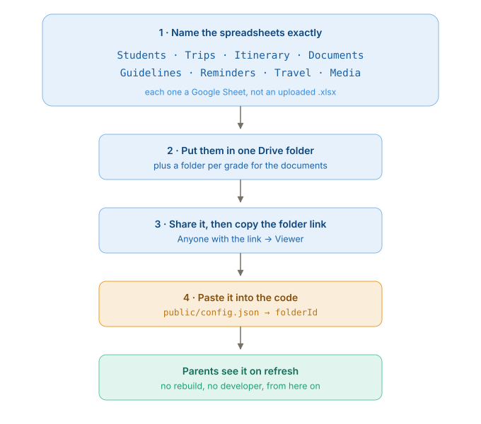
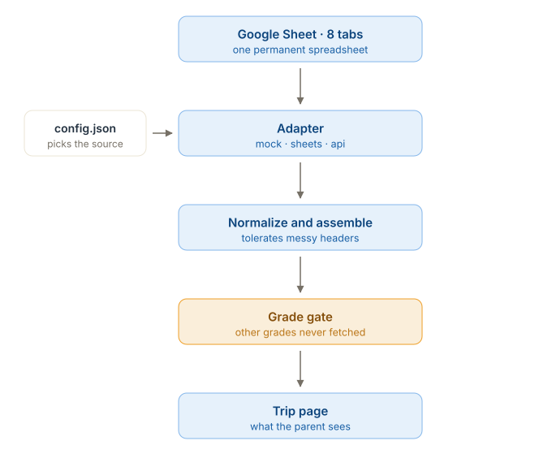
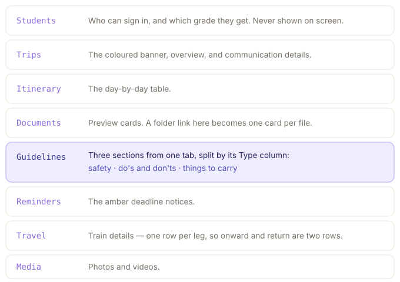
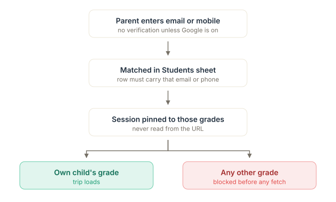

# Architecture

How the pieces fit together, in pictures. For the sheet contract see
[SHEET-SCHEMA.md](SHEET-SCHEMA.md); for setup see [CONNECT-SHEET.md](CONNECT-SHEET.md); for
the one-line answer to "where does the sheet plug in" see
[WHERE-TO-CONNECT.md](WHERE-TO-CONNECT.md).

---

## The setup, end to end

Name the eight spreadsheets, put them in one Drive folder, share it, paste that one link into
`public/config.json → folderId`. From then on the school edits sheets and parents see the
change on refresh.

`sample-data/Trip Explorer - Setup guide.pptx` is this same sequence as a deck for the
school-management discussion.

---

## 0. One link into the code

`public/config.json → sheetId` is the only place a Google link enters the codebase. It points
at the master spreadsheet; the master's `Settings` tab points at the individual sheets; the
`Documents` sheet points at the per-grade folders. The school can rearrange everything below
step one without a code change.

---

## 1. How data reaches a parent

One-way, and the gate sits late.

- **The spreadsheet is permanent.** It holds every grade and every trip at once. A new trip
  is new rows, never a new file — that is what keeps this from needing a developer.
- **`config.json` sits beside the app, not inside the bundle.** It is fetched at page load,
  so repointing the site at a different spreadsheet needs no rebuild and no redeploy. `.env`
  is only the fallback for values left blank.
- **One pasted link is the whole configuration.** Tabs are addressed by *name* through
  `gviz/tq?sheet=Students`, not by numeric gid, so nothing has to be looked up. The trade is
  that renaming a tab silently empties that section — a `gid` can be supplied to override.
- **An optional `Settings` tab lets the school move a source** to a different spreadsheet by
  pasting a link, without anyone editing `config.json`. Blank links mean "use the tab of the
  same name in this file", which is the normal case.
- **The adapter is swappable**: `mock` (sample data), `sheets` (Google CSV, or local CSV
  fixtures for the offline demo), `api` (a backend, not yet built).
- **Normalize is the shock absorber.** The school owns the sheets and will rename columns and
  write grades inconsistently. `Father Name`, `father_name` and `FatherName` all land on the
  same field; `7`, `Grade 7`, `Class 7` and `VII` all resolve to G7. Weakening this will
  break things quietly, months later.
- **The gate runs before the fetch**, not after — see picture 3.

## 2. Which tab becomes which section

Seven of the eight tabs map one-to-one onto something visible. Two exceptions worth knowing:

- **`Students` is never rendered.** It exists only to decide who can sign in and what grade
  they get.
- **`Guidelines` produces three sections from one tab**, split by its `Type` column
  (`Safety` / `Do` / `Dont` / `Carry`). Deliberate — the school maintains one sheet instead
  of three. It is also the tab most likely to confuse whoever maintains it.

A section only appears when it has rows. A grade with no `Trips` row shows "Nothing published
yet"; a grade with no `Media` rows simply has no photos section. That is intended, not a bug.

## 3. How a parent is held to one grade

- A row is reachable by **whichever of `FatherEmail` / `FatherPhone` is filled in**. Both
  blank means that child is invisible to everyone — the most common cause of "my parent
  cannot log in".
- Email matches case-insensitively; phone matches on the **last 10 digits**, so `+91` and
  spacing do not matter.
- **Grade is derived once, in `AuthContext`, from the matched rows.** No screen reads a grade
  from the URL or from user input. A parent with two children in different grades gets a
  picker and both grades.
- `/trip/:gradeId` checks `canAccessGrade` **before mounting**, and `useTrip` is passed
  `enabled: false` when it fails — so an unauthorised grade issues no request at all.

### What this does and does not protect

It stops the app from showing a parent another grade. It does **not** stop them reading the
source.

On the `sheets` setup the spreadsheet must be world-readable and its id ships in the page, so
a determined parent can open the raw sheet and read every family's name, email and phone —
bypassing the app entirely. The gate is a correct user experience and a genuine code-path
restriction, but it is **not a security boundary over the data**.

Closing that needs the `api` adapter: a small service holding a Google service-account key
that filters server-side and keeps the sheets private. The contract is written at the top of
`src/data/apiAdapter.js`. This is decision A in [DATA-HANDOVER.md](DATA-HANDOVER.md).

---

## Editing these diagrams

The SVGs in `diagrams/` are hand-written and self-contained — no build step, no external
fonts or styles. Open one in a text editor and change the labels. They use the app's own
palette from `src/styles/tokens.css`, and render with a transparent background so they sit
correctly on a light or dark page.
