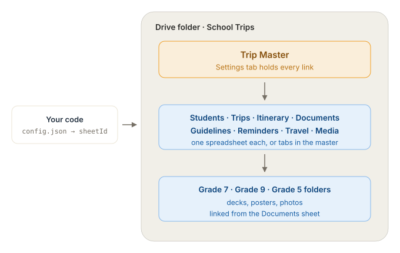

# Where the sheet connects to the code

**One file. One field.**

```
schoolTrips/public/config.json
```

That is the only place a Google link enters the code. Everything else is reached *through*
it. You choose one of two fields depending on how the data is arranged.

---

## Option 1 — connect a Drive folder (one link, everything inside)

```json
{
  "dataSource": "sheets",
  "folderId": "https://drive.google.com/drive/folders/1AbCdEf...",
  "driveApiKey": "AIza...",
  "csvBase": ""
}
```

The app lists the folder and works out which spreadsheet is which **by file name**.

> **This is the one thing that changes when you use a folder: file names stop being free
> and start being the address.** With a single spreadsheet the file could be called anything.
> Here, a file named `Students` is how the roster is found.

Name the spreadsheets in the folder:

`Students` · `Trips` · `Itinerary` · `Documents` · `Guidelines` · `Reminders` · `Travel` ·
`Media`

Matching is reasonably forgiving:

- Case, spaces and punctuation are ignored — `students`, `Students`, `STUDENTS` all match.
- Extra words are fine as long as only one file matches: `Grade 7 Itinerary 2026` → the
  `Itinerary` source.
- **Two files matching the same source is ambiguous, and the app takes neither** rather than
  guessing. `Winter Trips` and `Summer Trips` both match `Trips`, so neither is used and the
  browser console says so. Rename one.
- Files that are not Google Sheets are skipped — including an `.xlsx` that was uploaded but
  never converted. That is the commonest setup mistake, and the console names the file.

Requires **`driveApiKey`** — see [CONNECT-SHEET.md](CONNECT-SHEET.md) for creating one.
Without it a folder cannot be listed and the app falls back to `sheetId`.

## Option 2 — connect one spreadsheet

```json
{
  "dataSource": "sheets",
  "sheetId": "https://docs.google.com/spreadsheets/d/1AbCdEf.../edit?usp=sharing",
  "csvBase": ""
}
```

Everything lives in tabs inside that one file, or its `Settings` tab links out to others.
No API key needed. File names are irrelevant here — only tab names matter.

**Start with this one** unless you specifically want the folder to be the source of truth.
It has fewer moving parts and no API key.

---

## Both options: clear `csvBase`

While `csvBase` has a value the app reads the local demo CSVs and **ignores `folderId` and
`sheetId` entirely**. This is the single most likely reason for "I pasted my link and nothing
changed".

Save, refresh the page. No rebuild, no redeploy, no restart on a deployed site. (Locally,
`npm run dev` picks it up on refresh too.)

---

## The chain, in order



1. **`public/config.json`** holds one link → the **Trip Master** spreadsheet.
2. **Trip Master → `Settings` tab** holds a link per source. Blank means "use the tab of the
   same name in this file".
3. **The `Documents` sheet** holds links to the per-grade Drive folders.

So the school can move any sheet, add documents, or reorganise the folder — and the code
never changes, because only step 1 lives in code.

---

## Two layouts, both supported

### A. Everything in one spreadsheet — simplest
`sample-data/Trip Data.xlsx` — one file, 9 tabs (`Settings` plus the 8 sources).

Upload it, share it, paste its link into `sheetId`. Leave every link in `Settings` blank.
Done. **Start here unless you have a reason not to.**

### B. Master sheet linking separate spreadsheets — what you described
`sample-data/split/` — `Trip Master.xlsx` plus one file per source.

1. Upload all nine files to the Drive folder and open each as a Google Sheet.
2. Share **every one** of them: Anyone with the link → Viewer. A link in `Settings` pointing
   at a private file fails just like any other unshared sheet.
3. Open each source sheet, copy its address-bar link, and paste it into the matching row of
   `Trip Master`'s `Settings` tab.
4. Paste **only the Trip Master link** into `sheetId`.

Use B when different people own different sheets — the office keeps the roster, a coordinator
keeps the itinerary. The cost is eight more files to keep shared, and eight more places a
sharing setting can be wrong.

You can also mix: keep most sources as tabs in the master, and link out only the one sheet
that needs its own file.

---

## Checking it worked

Sign in as a parent from the roster. If the trip page loads, it's connected.

If not, the browser console names the failing sheet. The usual causes, in order of likelihood:

| Symptom | Cause |
|---|---|
| Nothing changed after pasting the link | `csvBase` is still set |
| "not shared publicly — Google returned a sign-in page" | That file isn't link-shared |
| One section empty, its sheet has rows | Tab renamed — tabs are found by name |
| A grade missing entirely | Its `Grade` cell spelling isn't recognised |
| Everything empty | `dataSource` isn't `"sheets"` |
| Folder configured but nothing loads | No `driveApiKey`, or the folder isn't shared |
| One source missing when using a folder | No file matches that name, two files match it, or the file is an unconverted `.xlsx` — the console says which |

---

## For the record: the other two ways in

`sheetId` is the normal route. Two lower-priority fallbacks exist and are only worth knowing
if something behaves unexpectedly:

- **`.env`** (`VITE_SHEET_ID`) — used only for values left blank in `config.json`. Baked in at
  build time, so it needs a rebuild to change. Fine for local development, wrong for a
  deployed site.
- **`sheetIds` in `config.json`** — a per-source file id. Only needed in unusual cases.

Resolution order for each source, first match wins:

1. `csvBase` — local demo CSVs, ignores everything below
2. a link in the **`Settings` tab**
3. `sheetIds` in `config.json`
4. a spreadsheet found in **`folderId`**, matched by file name
5. the master `sheetId`, tab addressed by name

Because 4 sits above 5, you can set both: the folder supplies whatever it has, and anything
missing from it falls back to the master spreadsheet. Within a chosen file, the app tries the
tab named after the source and then the first tab, so a dedicated file whose tab is still
called `Sheet1` still works.

Note that the `Settings` tab **beats** `config.json` here. That is deliberate: the school
should be able to move a sheet without waiting for a code change. It also means a stray link
left in `Settings` will quietly override your config — check there first if a source is
reading from somewhere unexpected.
